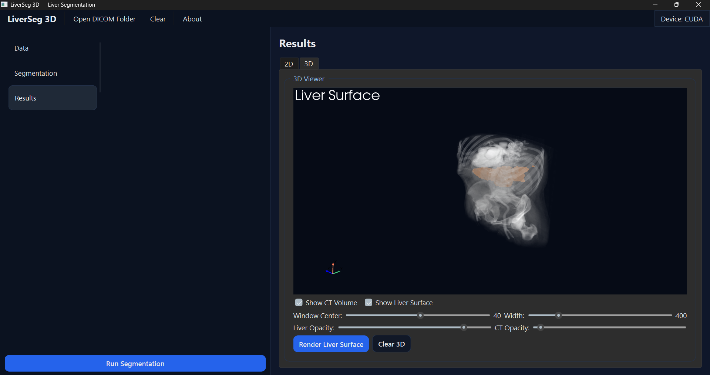
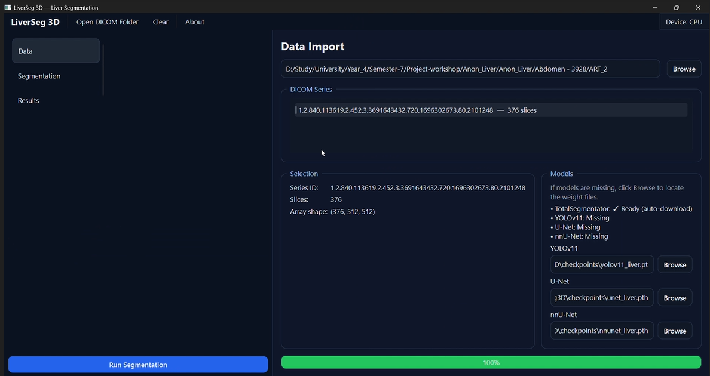
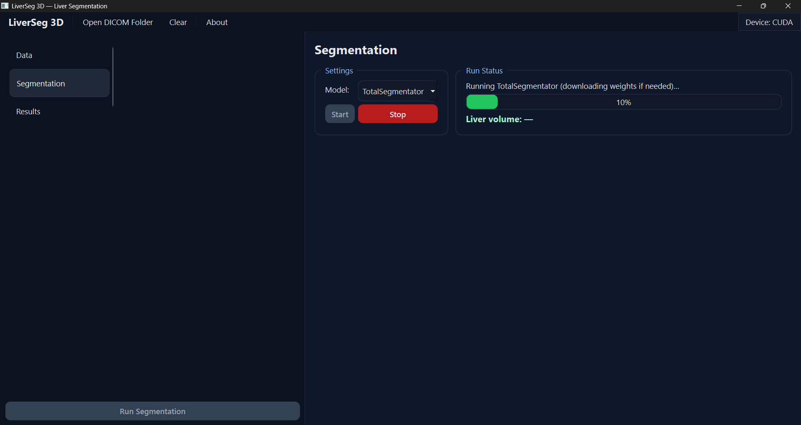
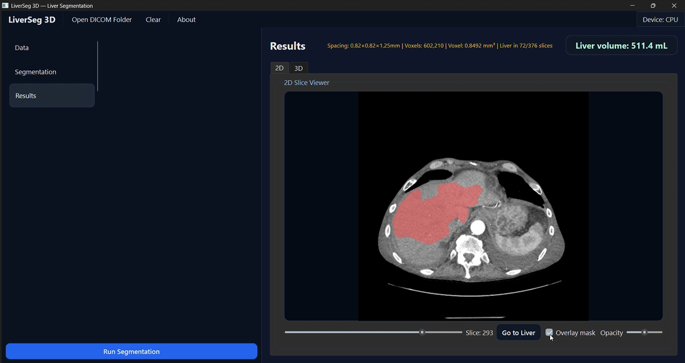
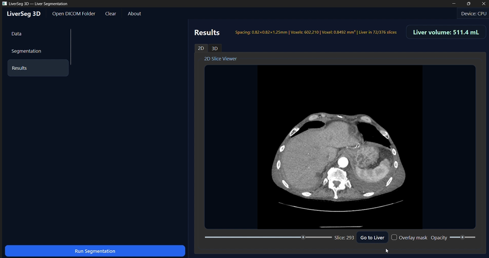
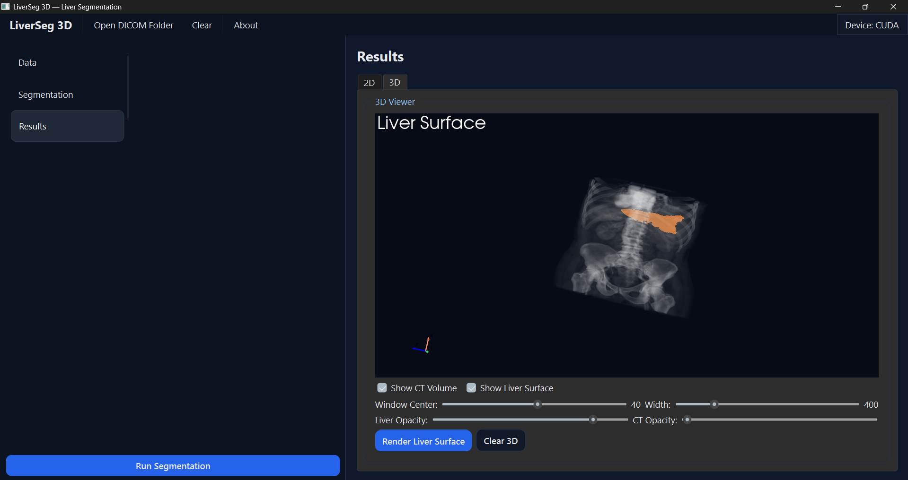

# LiverSeg 3D

Modern desktop app for liver segmentation from CT DICOM series (2D + 3D visualization).



## Overview

LiverSeg 3D loads a CT DICOM series, runs automatic liver segmentation (recommended: **TotalSegmentator**), then visualizes:

- **2D slices** with a transparent liver mask overlay.
- **3D view** with the CT volume + a smoothed liver surface mesh.
- **Liver volume (mL)** computed from voxel spacing.

This repository is intended for **education/research**. It is **not** a medical device.

## Key Features

- DICOM series browsing + loading
- TotalSegmentator integration (weights download automatically on first run)
- 2D viewer: slice slider + overlay opacity
- “Go to Liver” button (jumps to the middle liver slice)
- 3D viewer (PyVista):
  - CT volume rendering
  - Liver surface mesh (marching cubes + smoothing)
  - Window/Level controls
  - CT opacity + liver opacity controls
- CPU/GPU support (PyTorch CUDA)
- Logging to `liverseg3d.log`

## Screenshots

### Data Import


### Segmentation


### 2D Results


### 3D Results


#### More Screenshots



## Requirements

- Python 3.8+ (recommended 3.10+)
- Windows 10/11 (works on Linux/macOS too)
- RAM: 8 GB minimum (16 GB recommended)
- GPU: NVIDIA CUDA GPU recommended (works on CPU)

## Installation

From the project folder (the one that contains `requirements.txt`):

```bash
python -m venv .venv

# Windows
.venv\Scripts\activate

# Linux/macOS
source .venv/bin/activate

pip install -r requirements.txt
```

### Enable GPU (CUDA) for faster segmentation

If your app shows **Device: CPU**, install CUDA-enabled PyTorch. For CUDA 12.1:

```bash
pip uninstall -y torch torchvision
pip install torch torchvision --index-url https://download.pytorch.org/whl/cu121
```

Quick check:

```bash
python -c "import torch; print(torch.cuda.is_available()); print(torch.cuda.get_device_name(0) if torch.cuda.is_available() else 'CPU')"
```

## Run

```bash
python main.py
```

## How to Use

1. Open **Open DICOM Folder** and select a folder containing CT DICOM files.
2. Select a series from the list.
3. Go to **Segmentation**:
   - Choose **TotalSegmentator**
   - Click **Start**
4. Go to **Results**:
   - **2D** tab: use the slice slider, toggle overlay, adjust overlay opacity
   - Press **Go to Liver** to jump directly to the liver region
   - **3D** tab: enable CT volume / liver surface and adjust opacities + window/level

## About Models / Weights

### TotalSegmentator (Recommended)

- Pretrained and works out-of-the-box.
- Downloads weights automatically on first run (large download).

### YOLOv11 / U-Net / nnU-Net (Optional)

The UI includes optional entries for other models. These require you to provide your own trained weights files (not included in this repository).

## Project Structure

```text
LiverSeg3D/
  main.py
  config.py
  requirements.txt
  README.md
  .gitignore
  gui/
    main_window.py
    workers.py
  models/
    model_manager.py
  utils/
    dicom_loader.py
  checkpoints/            # (optional) local weights, not for GitHub
  docs/
    images/
```

## Troubleshooting

- 3D viewer missing: install `pyvista` + `pyvistaqt`.
- If segmentation is slow: confirm CUDA is available and that the app shows **Device: CUDA**.
- If DICOM series list is empty: verify the selected folder contains a valid CT series.
